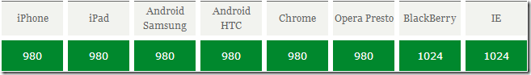
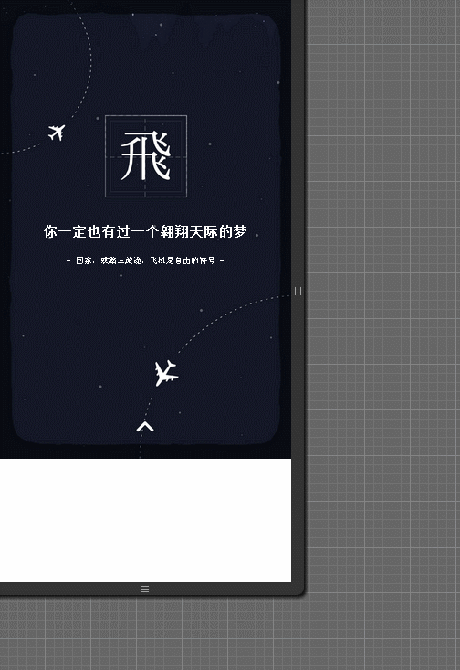

#第四节课：html5手机适配方案


标签: html5班


# 手机的设计图尺寸

在正式讲手机适配方案之前，我们先来看看**设计稿的尺寸**

请先看看下面这张图，看看他们之间的区别


微信朋友圈经常看到的H5页面(滑屏页面)，除了炫酷的动画效果之外，细心的你会发现有些H5页面在不同的移动设备上适配效果良好，页面的元素适配你的设备屏幕，并且展示完整的信息，如下图，页面在iPhone 6和iPhone 4不同屏幕分辨率下，内容自动适配，在iPhone4窄屏手机中男主角的下半身隐藏在屏幕外，但指引的信息完整展现在页面中。


那么问题来了！


 >响应式设计是否需要设计师提供多套的设计稿呢？例如宽屏手机(iPhone6)、窄屏手机(iPhone4)各自一套。


这里先介绍一下业界通常的做法：
一般情况会设计3个尺寸来满足大部分主流分辨率的屏幕，有ios的640X960(4，4s),640X1136（5,5S），1242X2208（6+）三套分辨率的设计，安卓则按照这3套尺寸做自适应。所以，最终设计师会提供iphone4,5,6+三套尺寸的视觉稿。

视觉稿不管1套还是2套，总要有一个基准尺寸。

那么问题又来了！

 >H5视觉稿是以什么尺寸来设计？

答案是：iphone5的尺寸作为设计标准

先看下面两张图


- 5占ios市场比例为47.4%，ios中占比最高
- 4占ios市场比例为23.10%，不可忽视的窄屏手机
- 5、6、6+共占据市场比例61.9%
- 5到6及6+的分辨率基本是等比例增大的，高与宽比约为178:100
- 178:100比例的机子
- IOS和安卓两大阵营超过60%以上为178:100的比例


#viewport的深入理解
##什么是viewport
>   通俗的讲，移动设备上的viewport就是设备的屏幕上能用来显示我们的网页的那一块区域，在具体一点，就是浏览器上(也可能是一个app中的webview)用来显示网页的那部分区域，但viewport又不局限于浏览器可视区域的大小，它可能比浏览器的可视区域要大，也可能比浏览器的可视区域要小。在默认情况下，一般来讲，移动设备上的viewport都是要大于浏览器可视区域的，这是因为考虑到移动设备的分辨率相对于桌面电脑来说都比较小，所以为了能在移动设备上正常显示那些传统的为桌面浏览器设计的网站，移动设备上的浏览器都会把自己默认的viewport设为980px或1024px（也可能是其它值，这个是由设备自己决定的），但带来的后果就是浏览器会出现横向滚动条，因为浏览器可视区域的宽度是比这个默认的viewport的宽度要小的。下图列出了一些设备上浏览器的默认viewport的宽度。




##理清px概念
- 设计像素
>也就是你的设计图的尺寸，例如上面说的i5设计尺寸为640X1136,就是表示设计像素

- 设备像素
>设备的物理像素，也就是你的屏幕的实际分辨率，例如
i4为**640X960**,i5为**640X1136**,i6为**667X375**,i6P为**414X736**

- 设备像素比 (devicePixelRatio)
```
devicePixelRatio = 设备像素 / 设计像素
```
>你可以理解为一个css像素代表多少个设备像素。
>在javascript中，可以通过```
window.devicePixelRatio```
获取到当前设备的dpr
>在css中，可以通过```
-webkit-device-pixel-ratio```
，```
-webkit-min-device-pixel-ratio```
和 ```
-webkit-max-device-pixel-ratio```
进行媒体查询，对不同dpr的设备，做一些样式适配(这里只针对webkit内核的浏览器和webview)。


>例如，在Retina屏的iphone上，devicePixelRatio的值为2，也就是说1个css像素相当于2个物理像素。


但是要注意的是，devicePixelRatio在不同的浏览器中还存在些许的兼容性问题，所以我们现在还并不能完全信赖这个东西。

> 但我们依然可以用来做为媒体查询的条件：
例如判断IPHONE5
```css
@media screen and (device-width: 320px) and (device-height: 568px) and (-webkit-device-pixel-ratio: 2){
    /*do something*/
}
```

通常我的会结合下面的媒体查询
```css
@media  screen and (max-height: 835px) {
    /*更BT的窄屏机*/
}
@media  (min-height: 836px) and (max-height: 940px) {
    /*ip4，魅族3*/
}
@media (min-height: 940px) and (max-height: 1008px) {
    /*主流机型*/
}
@media screen and (min-height: 1009px) and (max-height: 9999px) {
    /*I6P或其他宽屏机*/
}

```


##常用viewport的语法：
```html
<meta name="viewport" content="width=device-width, initial-scale=1.0, maximum-scale=1.0, user-scalable=0">
```
<meta name="viewport" content="width=640">

| 属性 | 说明 |
| -- | -- |
|width	| 设置layout viewport的宽度，为一个正整数，或字符串"width-device"|
|initial-scale	|设置页面的初始缩放值，为一个数字，可以带小数 |
|minimum-scale	| 允许用户的最小缩放值，为一个数字，可以带小数 |
|maximum-scale	| 允许用户的最大缩放值，为一个数字，可以带小数|
|height	| 设置layout viewport  的高度，这个属性对我们并不重要，很少使用 |
|user-scalable |是否允许用户进行缩放，值为"no"或"yes", no 代表不允许，yes代表允许 |


#手机适配方案
案例：
不同手机看效果，同一手机切换横竖屏看效果


##原理及说明
- 使用transform:scale缩放页面，要求视觉稿高清
- 页面以px为单位即可让h5适配各种移动设备，适配原则根据视觉稿比例缩放页面
- 兼容性良好，支持ios4+、android2.3+、winphone8+系统
- 大小1.22k，零依赖
- 三种适配模式可选 auto || contain || cover

##contain模式（推荐）
- 保持页面的宽高比，调整页面的宽度或高度（较大者），使页面完全包含在浏览器窗口中
- 页面水平垂直居中，左右或上下可能出现空白，页面背景使用纯色或可复制背景可解决此类问题
- 适合滑屏页面、单屏页面

[预览:](http://sallypanda.gicp.net/AdaptationDemo-master/pageResponse_contain.html)


cover模式
- 保持页面的宽高比，调整页面的宽度或高度（较小者），使页面完全覆盖浏览器窗口
- 页面水平垂直居中，超出浏览器窗口左右或上下的内容会被隐藏
- 适合滑屏页面、单屏页面，且页面边缘无重要内容

[预览:](http://sallypanda.gicp.net/AdaptationDemo-master/pageResponse_cover.html)


auto模式（默认模式）
- 保持页面的宽高比，调整页面的宽度，使页面宽度完全包含在浏览器窗口中

[预览:](http://sallypanda.gicp.net/AdaptationDemo-master/pageResponse_auto.html)




[github地址](https://github.com/sallypanda/MobileScroll-And-FullScreenAdaptation)


#快速上手
> meta的viewport设置：

```html
<meta content="width=device-width,initial-scale=1.0,maximum-scale=1.0,user-scalable=no" name="viewport">
```
>启用插件代码示例一：
```html
<div class="page">
    
    <h1>你一定也有过一个翱翔天际的梦1</h1>
    <p>-  回家，或踏上旅途，飞机是自由的符号  -</p>
</div>
```

```javascript
//视觉稿尺寸是640px*1008px，页面样式是以视觉稿尺寸除以2来计算，那么输入页面的宽度为320px和高度为504px
window.onload = window.onresize = function(){
    var page = new pageResponse({
        class : 'page',     //模块的类名，使用class来控制页面上的模块(1个或多个)
        mode : 'contain',     // auto || contain || cover
        width : '320',      //输入页面的宽度，只支持输入数值，默认宽度为320px
        height : '504'      //输入页面的高度，只支持输入数值，默认高度为504px
    })
}
```

> 启用插件代码示例二：

```html
<!-- 2个模块（包含隐藏的）都包含class:page，pageResponse可对这2个模块起作用 -->
<div class="page">
    
    <h1>你一定也有过一个翱翔天际的梦1</h1>
    <p>-  回家，或踏上旅途，飞机是自由的符号  -</p>
</div>

<div class="page hide">
    <p>是否还记得她</p>
    

</div>
```

```javascript
//视觉稿尺寸是640px*1008px，页面样式是以视觉稿原始尺寸来计算，那么输入页面的宽度为640px和高度为1008px
window.onload = window.onresize = function(){
    var page = new pageResponse({
        class : 'page',     //模块的类名，使用class来控制页面上的模块(1个或多个)
        mode : 'contain',     // auto || contain || cover
        width : '640',      //输入页面的宽度，只支持输入数值，默认宽度为320px
        height : '1008'      //输入页面的高度，只支持输入数值，默认高度为504px
    })
}
```


#全屏适配+滑动手势

[下期预告](http://sallypanda.gicp.net/MobileScroll-And-FullScreenAdaptation/fullpage.html)


