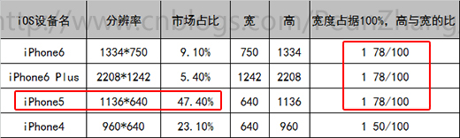
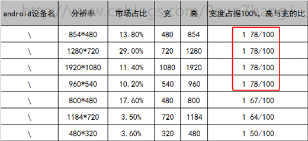

# 手机的适配方案

在正式讲手机适配方案之前，我们先来看看**设计稿的尺寸**

请先看看下面这张图，看看他们之间的区别

微信朋友圈经常看到的H5页面(滑屏页面)，除了炫酷的动画效果之外，细心的你会发现有些H5页面在不同的移动设备上适配效果良好，页面的元素适配你的设备屏幕，并且展示完整的信息，如下图，页面在iPhone 6和iPhone 4不同屏幕分辨率下，内容自动适配，在iPhone4窄屏手机中男主角的下半身隐藏在屏幕外，但指引的信息完整展现在页面中。

那么问题来了！

 >响应式设计是否需要设计师提供多套的设计稿呢？例如宽屏手机(iPhone6)、窄屏手机(iPhone4)各自一套。

这里先介绍一下业界通常的做法：
一般情况会设计3个尺寸来满足大部分主流分辨率的屏幕，有ios的640X960(4，4s),640X1136（5,5S），1242X2208（6+）三套分辨率的设计，安卓则按照这3套尺寸做自适应。所以，最终设计师会提供iphone4,5,6+三套尺寸的视觉稿。

视觉稿不管1套还是2套，总要有一个基准尺寸。

那么问题又来了！

 >H5视觉稿是以什么尺寸来设计？

答案是：iphone5的尺寸作为设计标准

先看下面两张图

- 5占ios市场比例为47.4%，ios中占比最高
- 4占ios市场比例为23.10%，不可忽视的窄屏手机
- 5、6、6+共占据市场比例61.9%
- 5到6及6+的分辨率基本是等比例增大的，高与宽比约为178:100
- 178:100比例的机子
- IOS和安卓两大阵营超过60%以上为178:100的比例

